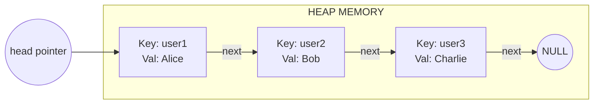
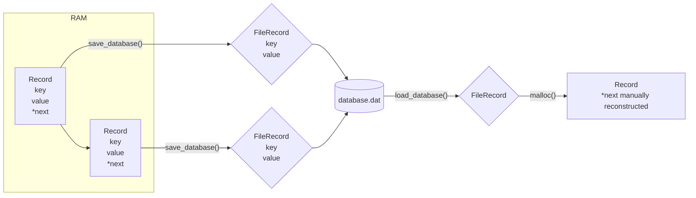
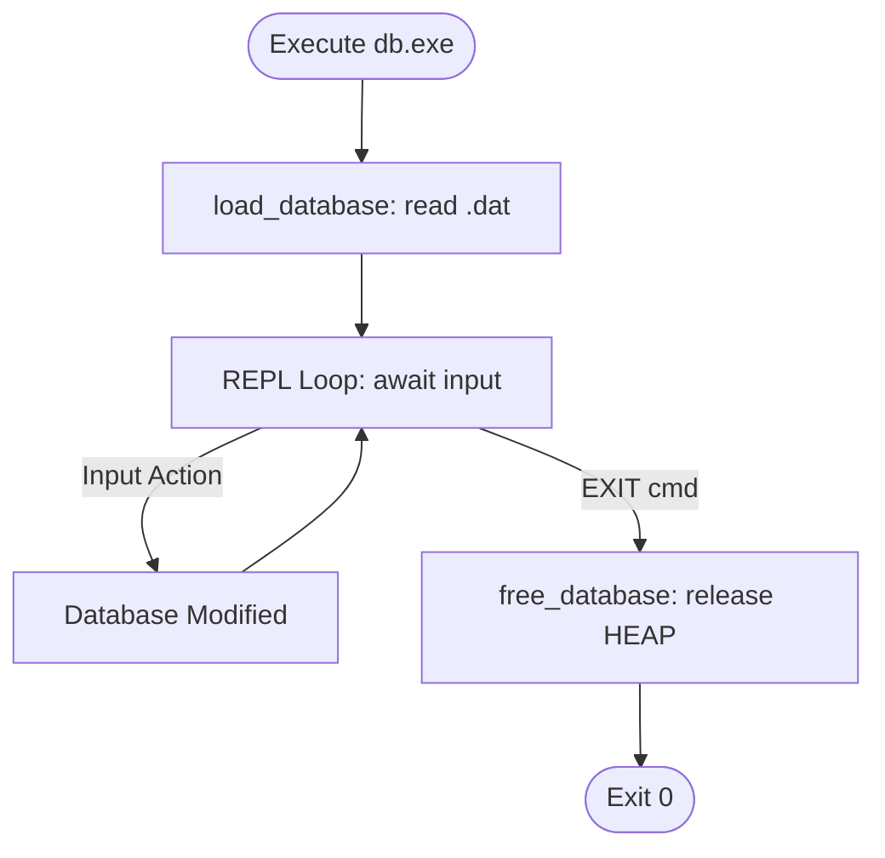

# Master Key-Value Database Engine (Pure C)

## 1. Project Overview
This project is an advanced, educational systems-programming implementation of a lightweight Key-Value Database Engine written entirely in pure C. It mimics the fundamental core behaviors of **Redis** (in-memory fast storage) and **SQLite** (file-based persistence). The project focuses intensely on modularity, memory safety, pointer manipulation, and dynamic heap allocation.

## 2. Architecture Diagram

```mermaid
flowchart TD
    UI[Terminal REPL UI] <--> Parser[Parser Module]
    Parser --> |Valid Commands| DB[Database Core Engine]
    DB <--> |Memory| LL[Linked List Nodes (Heap)]
    Parser --> |Persistence| Storage[Storage Engine]
    Storage <--> |I/O Streams| Disk[(database.dat)]
```

## 3. Concepts Used
*   **Dynamic Heap Allocation:** `malloc()` and `free()` for scaling memory at runtime.
*   **Linked Lists:** Dynamically linking non-contiguous nodes to store key-value data `O(n)`.
*   **Pointer Manipulation:** Safely unlinking memory blocks during deletion without dangling pointers.
*   **String Parsing:** Tokenization using `strtok()` with stateful pointer bounds checking.
*   **Binary File I/O:** Serializing structs using `fread()` and `fwrite()` safely without dumping memory pointers.
*   **Systems Architecture:** Separation of concerns via header `.h` and source `.c` compilation units.

## 4. Compilation Instructions
The project uses `make` (or `mingw32-make` on Windows) for compilation.

```bash
# Standard compilation
make

# Debug compilation (Includes -g, -Wall, -Wextra, -DDEBUG)
make debug

# Clean compiled objects
make clean
```
*(If you lack a Make environment, simply run: `gcc main.c parser.c database.c storage.c -o db.exe`)*

## 5. Windows MinGW Instructions
This project is heavily optimized to build directly on Windows using **MinGW GCC**.
1. **Ensure MinGW is installed:** It should reside in `C:\MinGW` or similar.
2. **Add to PATH:** Go to Windows System Environment Variables -> Path -> Edit -> Add `C:\MinGW\bin`.
3. **Open Terminal (cmd or PowerShell):** Verify installation by typing `gcc --version` and `mingw32-make --version`.
4. **Compile:** Run `mingw32-make` in this project directory. The custom Makefile utilizes Windows-native `del` commands to ensure `clean` targets run flawlessly.

## 6. Command Examples
| Command | Example Usage | Description |
| :--- | :--- | :--- |
| **PUT** | `PUT name Nitish` | Inserts or updates the key `name` with value `Nitish`. |
| **GET** | `GET name` | Retrieves the value for the key `name`. |
| **DELETE** | `DELETE name` | Removes the key from the heap memory. |
| **SHOWALL** | `SHOWALL` | Displays all database nodes. |
| **SAVE** | `SAVE` | Commits heap memory to binary disk storage. |
| **LOAD** | `LOAD` | Reconstructs the database from disk. |
| **HELP** | `HELP` | Displays the menu. |
| **EXIT** | `EXIT` | Safely frees heap memory and exits. |

## 7. Linked-List Explanation
Data in memory is stored in a dynamically expanding **Singly Linked List**. Each inserted record requests a block of memory from the OS Heap. Instead of arrays (which require contiguous blocks and resizing), each linked list node maintains a `next` pointer pointing to the memory address of the subsequent node.



## 8. Memory Management Explanation
*   **Stack Memory:** Variables like the `input` string buffer in `main.c` are statically sized and automatically cleared when a function exits.
*   **Heap Memory:** Nodes are created using `malloc()`. This memory remains reserved until explicitly released with `free()`.
*   **Memory Safety:** The `free_database()` function acts as the garbage collector, running linearly through the list during `EXIT` or `LOAD` to return every block to the OS to prevent memory leaks.

## 9. File Persistence Explanation
Writing C pointers to a file causes catastrophic failures upon reboot, because OS-assigned memory addresses change every execution. 
Our Storage Engine avoids this by translating the runtime `Record` struct (which contains pointers) into a flat `FileRecord` struct (which strips out pointers) before using `fwrite()`.



## 10. Time Complexity
Because this project utilizes a Linked List without indexing, lookups require linear traversal.

| Operation | Best Case | Worst Case | Memory Complexity |
| :--- | :--- | :--- | :--- |
| **PUT** (Insert new) | O(1) (prepend) | O(n) (verify duplicates) | O(1) auxiliary |
| **GET** (Search) | O(1) (at head) | O(n) (at tail/missing) | O(1) |
| **DELETE** | O(1) (at head) | O(n) (at tail/missing) | O(1) |
| **SHOWALL** | O(n) | O(n) | O(1) |

*(Future hash-table upgrades can reduce search times to O(1).)*

## 11. Debugging Instructions
When editing the C files, you may introduce Segmentation Faults (dereferencing a NULL pointer).
To catch these:
1. Compile with the debugger flags: `mingw32-make debug`.
2. This activates embedded `#ifdef DEBUG` trace statements that print raw memory addresses and variable states directly to the terminal as actions occur.

## 12. Valgrind Notes
If you are running this project inside a Linux environment (or WSL on Windows), use Valgrind to ensure your pointer management is flawless:
```bash
valgrind --leak-check=full --show-leak-kinds=all ./db
```
The goal is to receive a report stating `All heap blocks were freed -- no leaks are possible`.

## 13. Future Scalability Roadmap
The architecture is designed to scale dynamically for future systems programming practice:
*   **Level 1 (Current):** Linked-list Engine + Binary Dumps.
*   **Level 2:** Replace the Linked List in `database.c` with a **Hash Table** for `O(1)` time complexity.
*   **Level 3:** Add an **Append-Only File (AOF)** WAL log so the database persists in real-time instead of relying solely on the manual `SAVE` command.
*   **Level 4:** Implement **Sockets** to allow network connections (Client-Server architecture).
*   **Level 5:** Implement **Pthreads** and Mutex locks for concurrent multi-client connections.

## 14. Example Execution Flow

### Database Lifecycle Flow


### Parser Execution Flow
```mermaid
flowchart TD
    Raw[Raw String: 'PUT user Nitish\n'] --> Strip[Strip '\\n' using strlen]
    Strip --> Tok1[strtok: isolate 'PUT']
    Tok1 --> Match{strcmp match?}
    Match -- PUT --> Tok2[strtok: isolate 'user']
    Tok2 --> Tok3[strtok: isolate rest of string 'Nitish']
    Tok3 --> Verify{Missing fields?}
    Verify -- Valid --> Exec[put_value('user', 'Nitish')]
    Verify -- Invalid --> Err[Print Syntax Error]
```
